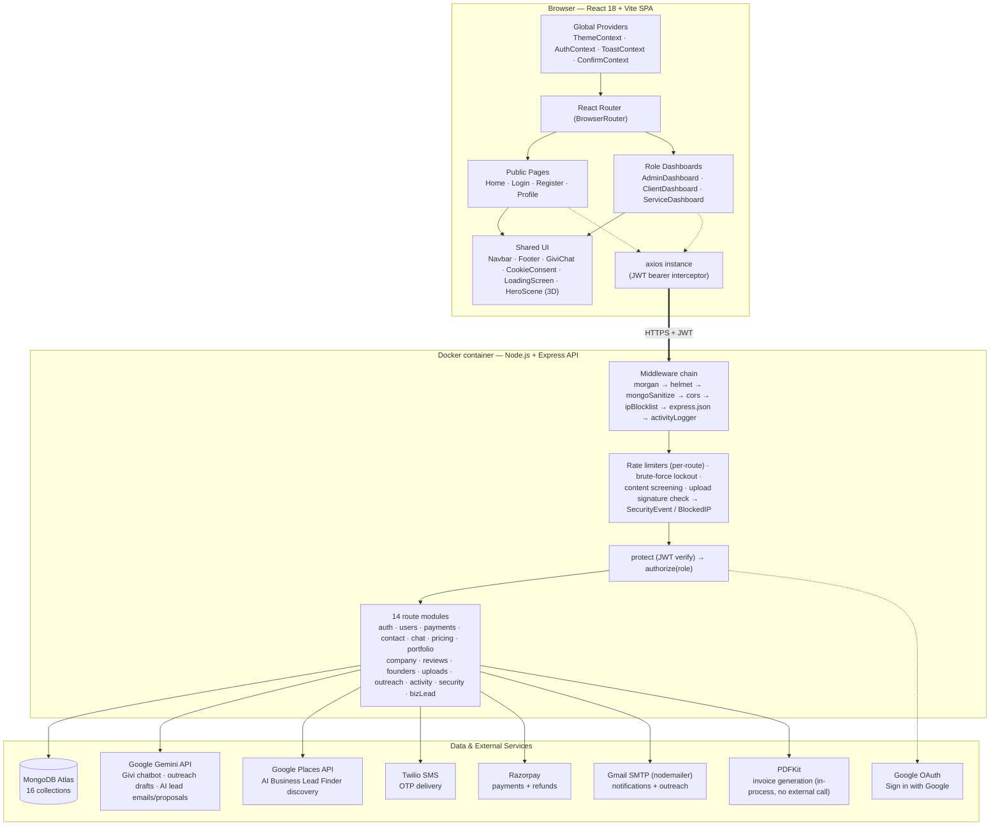
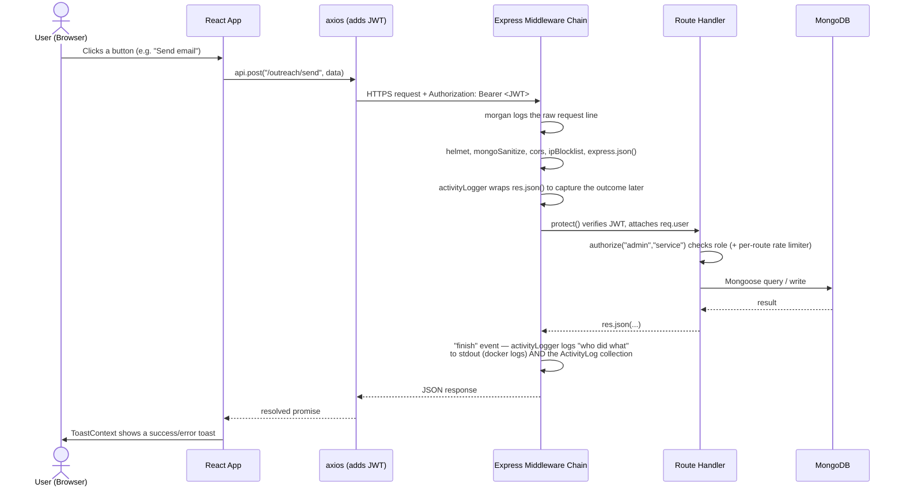
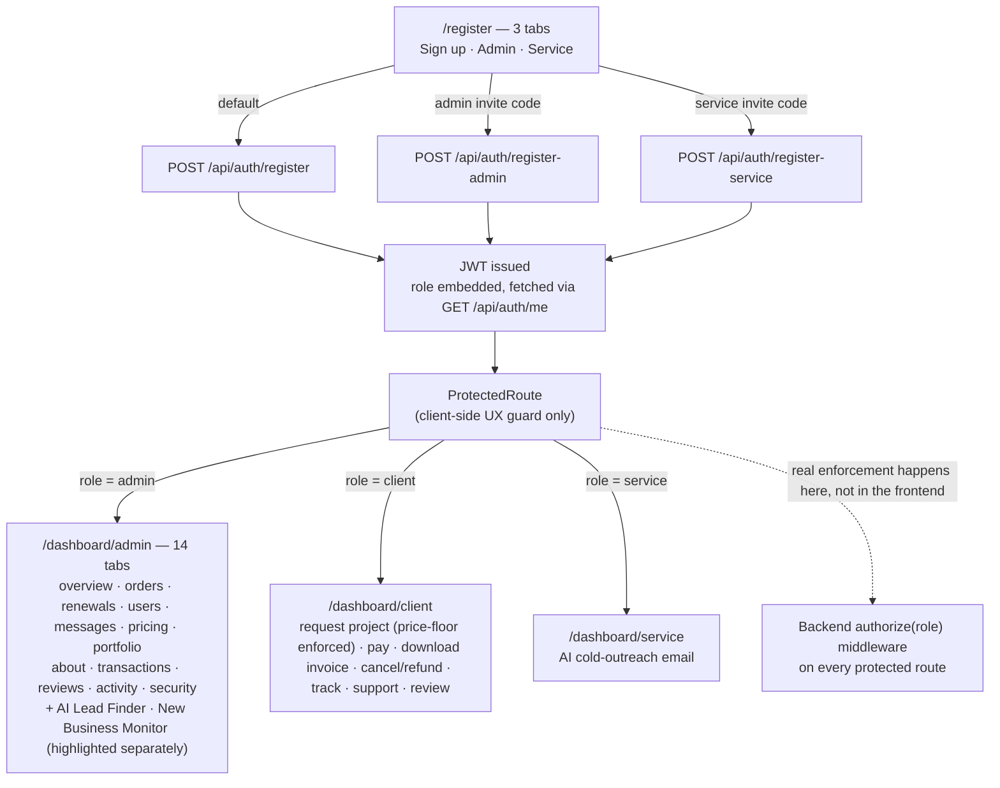
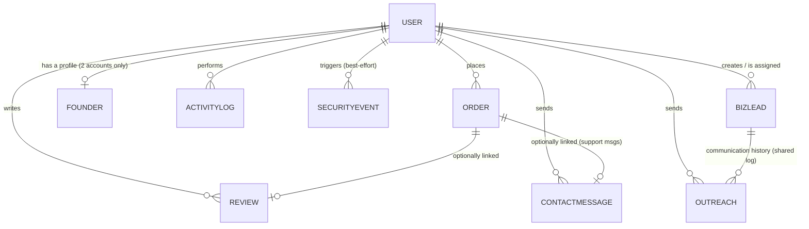
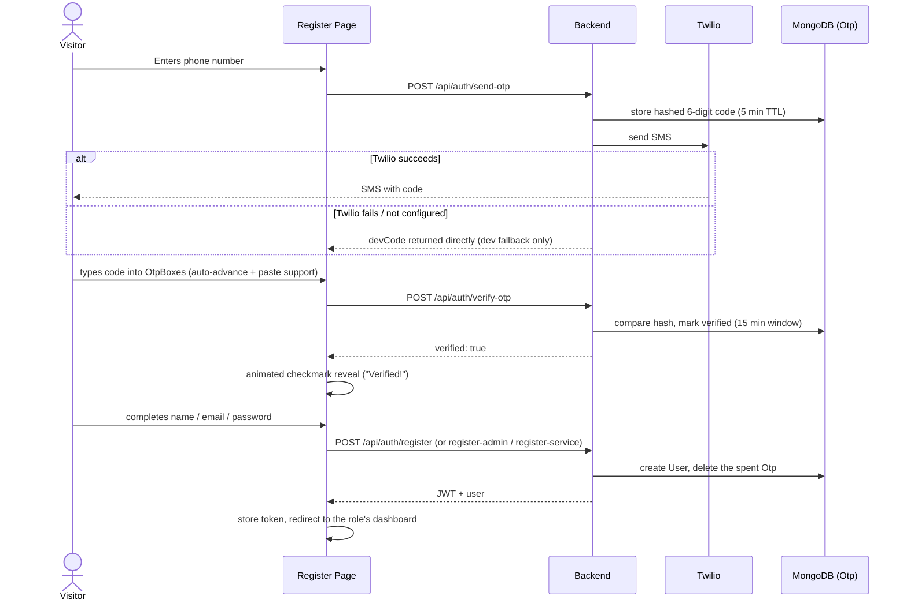

# GivsiaTech — Architecture & Control Flow

Internal reference only. This file lives in `docs/`, outside `frontend/src`
and `frontend/public`, so it is never bundled by Vite or served by the
website — nothing here reaches the live site.

Diagrams are Mermaid — render natively in VS Code (Markdown Preview),
GitHub/GitLab, Obsidian, or open `architecture.html` in this same folder
for a standalone browser view (kept in sync with this file).

---

## 1. System architecture



---

## 2. Request / control flow (a typical authenticated call)



Two logging layers run on every request, independently:
- **morgan** — raw HTTP line (method, path, status, timing) → stdout only.
- **activityLogger** — human-readable "who did what" → stdout **and**
  persisted to Mongo (`ActivityLog`), visible in the admin dashboard's
  Activity tab. Read-only GETs are skipped; only side-effecting requests
  are logged. This is fully generic (mounted once, works for every route
  without touching individual route files) — new routes like `bizLeadRoutes.js`
  get audited automatically, with friendly labels added to
  `middleware/activityLogger.js`'s `ACTION_RULES`.

---

## 3. Role-based registration & routing



The frontend guard (`ProtectedRoute`) only controls what's *shown*. The
actual security boundary is server-side — every protected route re-checks
the JWT and role independently, so tampering with frontend state can't
grant access to data the backend wouldn't otherwise allow. The two AI
Business Discovery tabs are admin-only by the same mechanism — there is no
separate "sales rep" role in this pass, per the module's own scoping
decision (see §6).

---

## 4. Data model relationships



`Pricing`, `Portfolio`, and `CompanyInfo` are standalone content
collections (admin-editable, no user references) — they feed the public
site sections, Givi's chatbot context, *and* the AI Lead Finder's
outreach/proposal generation (same `buildServiceContext()` helper, shared
across `chatRoutes.js`, `outreachRoutes.js`, and `bizLeadRoutes.js` so all
three ground their AI output in the same real facts). `Otp` and
`PasswordReset` are ephemeral (TTL-expired). `SecurityEvent` (90-day TTL)
and `BlockedIP` are IP-keyed, not user-keyed — the USER link on those is
optional/best-effort. `BizLead` reuses the existing `Outreach` collection
as its communication history (an optional `lead` ref was added to
`Outreach` rather than building a second email-log) — so an email sent
from a lead's detail page shows up in both places from one write.

---

## 5. Phone OTP verification + registration flow



Every email/phone input site-wide (this form, Login, Profile, Contact,
Admin's Add User) now also gets live client-side format validation — a red
warning icon while the value doesn't match the expected shape, a green
check once it does (`ValidatedInput.jsx` + `utils/validators.js`, the
phone regex mirroring the backend's own `normalizePhone`). This is UX
feedback only; the backend independently re-validates on every write.

---

## 6. Payment → Invoice → Refund flow

```mermaid
sequenceDiagram
    actor C as Client
    participant FE as Client Dashboard
    participant API as paymentRoutes.js
    participant RZP as Razorpay
    participant DB as MongoDB (Order)
    participant Mail as sendEmail

    C->>FE: Requests a project (service + custom amount)
    FE->>API: POST /payments/create-order
    API->>API: Enforce price floor —<br/>amount >= Pricing.basePrice - 5000
    API->>RZP: orders.create()
    RZP-->>API: razorpay order id
    API->>DB: Order { paymentStatus: "unpaid" }
    C->>RZP: Completes checkout (Razorpay widget)
    FE->>API: POST /payments/verify (signature)
    API->>DB: Order { paymentStatus: "paid" }
    API-->>Mail: payment confirmation email

    Note over C,DB: Self-cancellation window — 48h from request
    C->>FE: Cancel project
    FE->>API: PATCH /payments/orders/:id/cancel
    alt order is paid
        API->>RZP: payments.refund(paymentId, amount)
        alt refund API call succeeds
            RZP-->>API: refund id
            API->>DB: Order { paymentStatus: "refunded", refundId, refundedAt }
            API-->>Mail: refund confirmation email
        else refund API call fails
            API-->>FE: 502 — order left COMPLETELY unchanged
            Note over API,DB: fail-safe: never mark "cancelled"<br/>on a refund promise that didn't actually succeed
        end
    else order was never paid
        API->>DB: Order { status: "cancelled" }
    end

    C->>FE: Download invoice / payment details
    FE->>API: GET /payments/orders/:id/invoice (blob, JWT header)
    API->>API: generateInvoicePdf() — PDFKit, streamed directly to the response
    API-->>FE: application/pdf
    Note over FE: axios responseType:"blob" + createObjectURL —<br/>a plain &lt;a href&gt; can't carry the Authorization header
```

The invoice PDF includes a refund note section when
`paymentStatus === "refunded"`. PDFKit's standard fonts have no ₹ (U+20B9)
glyph, so amounts render as `Rs. 25,000` rather than the rupee symbol —
a font limitation, not a bug.

---

## Key architectural decisions worth remembering

- **Security enforced server-side only.** `ProtectedRoute` on the frontend
  is UX convenience; every backend route independently re-verifies the JWT
  and role via `protect`/`authorize`.
- **AI features are grounded, not freeform.** Givi (chat), the Service
  Dashboard's outreach drafts, and the AI Lead Finder's email/proposal
  generation all pull live data from MongoDB (pricing/portfolio/founders)
  into the prompt context via one shared `buildServiceContext()` helper,
  rather than letting the model invent facts — or drift between three
  separate copies of "what services do we offer."
- **Two independent logging layers.** `morgan` (raw HTTP) and
  `activityLogger` (semantic audit trail) are separate, composable
  middleware — one is infra-level, the other is business-level.
- **Security controls are detection-driven, not just preventive.** Rate
  limits, brute-force lockout, and content screening all feed one
  `SecurityEvent` log; `registerViolation()` correlates violations *across*
  endpoints per IP, not just per-route.
- **Fail-safe over fail-silent for money.** The refund flow never marks an
  order "cancelled"/"refunded" unless Razorpay's refund call actually
  succeeded — a failed API call leaves the order's state untouched and
  surfaces a clear error, instead of silently promising a refund that
  didn't happen.
- **Price floor is enforced where the money moves, not just in the UI.**
  The client dashboard's request-project form mirrors the ₹5,000-below-
  `basePrice` floor for UX, but `POST /payments/create-order` re-derives
  and enforces it server-side independently — the frontend check is
  convenience, not the boundary.
- **New data-gathering features are scoped to what's actually legal to
  automate.** The AI Business Lead Finder discovers businesses via
  Google's official Places API (paid, ToS-compliant) rather than scraping
  Google Maps/Justdial; the New Business Monitor (company-registry
  leads) is CSV-import/manual-entry only, since India's MCA registry has
  no free bulk API and scraping it isn't ToS-compliant either. Both facts
  are surfaced directly in the admin UI's own copy, not hidden.
- **Theme system is CSS-variable-driven.** Almost everything adapts to
  light/dark automatically via `var(--lavender)`, `var(--surface)`, etc.
  Only real WebGL/Canvas scenes (`HeroScene`, `LoadingScreen`) need an
  explicit per-theme JS color palette, since Three.js materials require
  literal hex values.
